# **VehiclePark** 🚗
___
📖 Описание:  
VehiclePark — это система для управления автопарком предприятий с водителями и автомобилями, 
позволяет создавать, изменять автомобили, отслеживать поездки и выгружать отчеты о пробегах.

**_Основные возможности:_**
* 🔐 Поддержки двух видов авторизации:  
[Классическая (через форму входа) для веб-интерфейса](#login) и JWT-токены для REST API
* 🏢 [Учёт предприятий и их менеджеров](#enterprises)
* 🚘 [Управление парком автомобилей](#cars)
* 🛰️ [Хранения GPS-данных и построения треков поездок на карте](#map)
* 📊 [Выгрузка отчета о пробеге автомобилей](#report)
* 📝 [Получение запросов по REST c JWT](#rest) 
* 🤖 [Отправки уведомлений в Telegram-бота и на почту](#tg-bot)
* ℹ️ [Документация по основным конечным точкам - Swagger](#swagger)
* 🚀 [Запуск проекта](#deploy)

___
🛠️ _**Технологический стек:**_  
Backend: Spring Boot 3.3.5, Spring Security, Spring Data JPA, Spring Kafka  
Database: PostgreSQL 16+ with PostGIS для геоданных  
Routing: OpenRouteService  
Message Broker: Apache Kafka  
Monitoring: Prometheus, Grafana, Spring Boot Actuator  
Containerization: Docker, Docker Compose   
Tests: JUnit, Mockito, Cypress, Playwright  
Load Testing: k6, wrk  
Telegram Integration: Telegram Bot API  
___
🏗 _**Архитектура проекта:**_  
Проект реализован в виде 3-х микросервисов, которые взаимодействуют через Kafka:

* vehiclepark-core — основной сервис (менеджеры, предприятия, водители, авто, GPS, REST API)
* notification-service — принимает события и отправляет их в Kafka
* telegram-bot-service — отдельный микросервис для уведомлений в Telegram
* Prometheus + Grafana + Alertmanager — мониторинг, метрики, алерты на почту и в телеграмм
* PostgreSQL (PostGIS) — основная база данных
* NGINX — прокси
___
📸 Скриншоты  

👥 **_Авторизация менеджера_**  
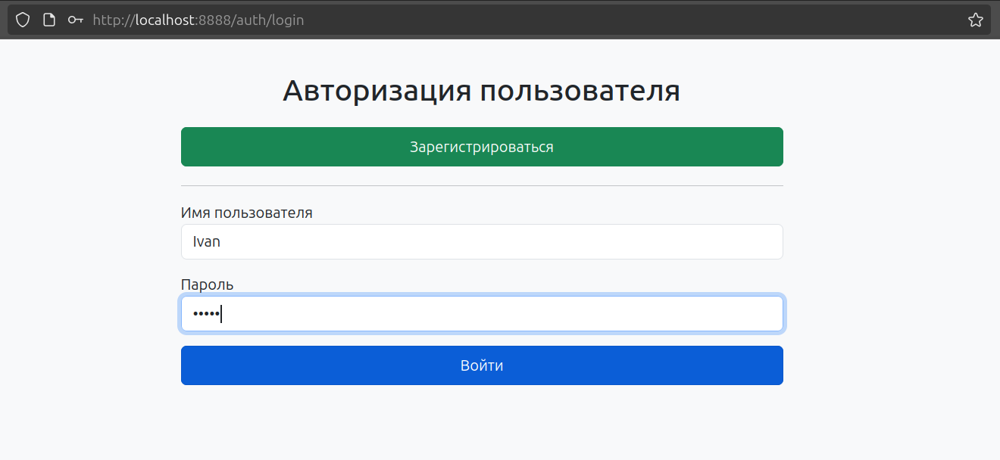

🏢 **_Список предприятий менеджера_**  
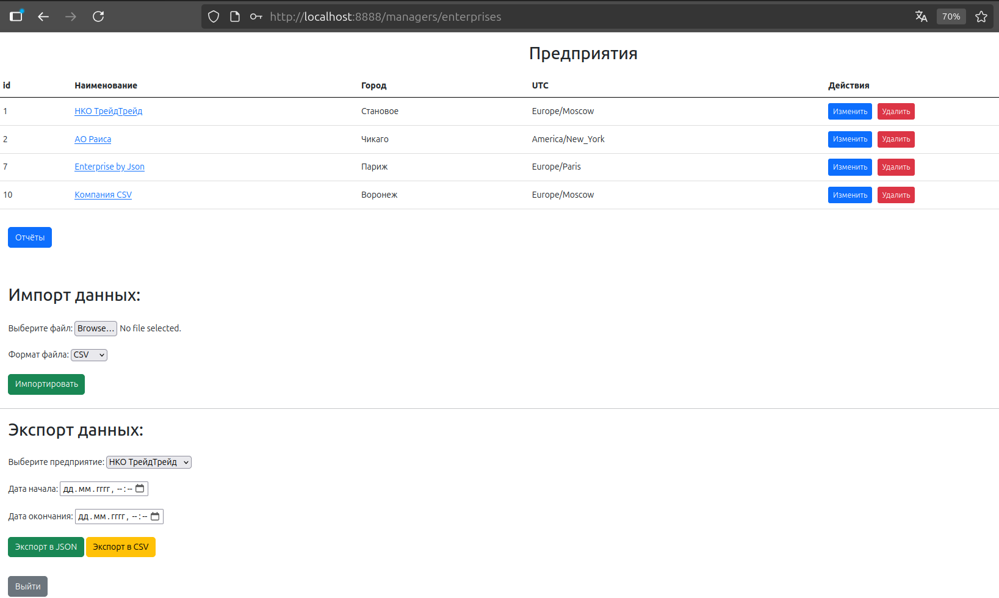

🚘 _**Список машин предприятия**_  
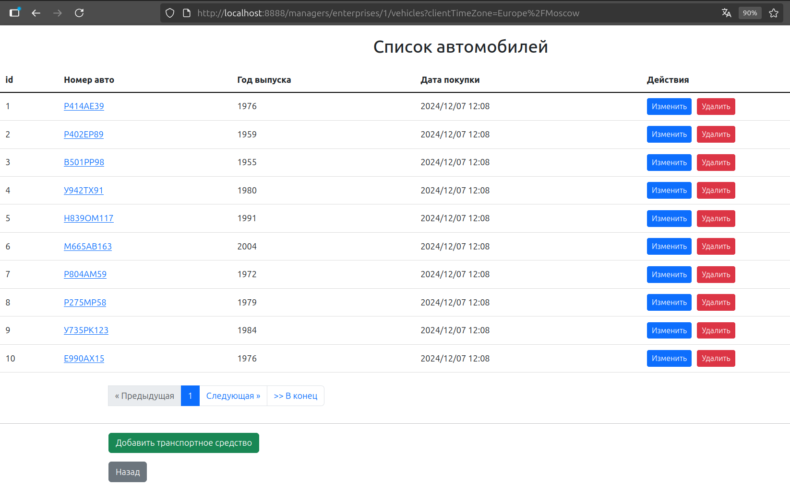

🚗 _**Просмотр информации о машине**_  
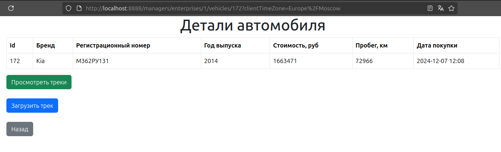

🛰️ _**Отображение треков автомобилей на карте**_  
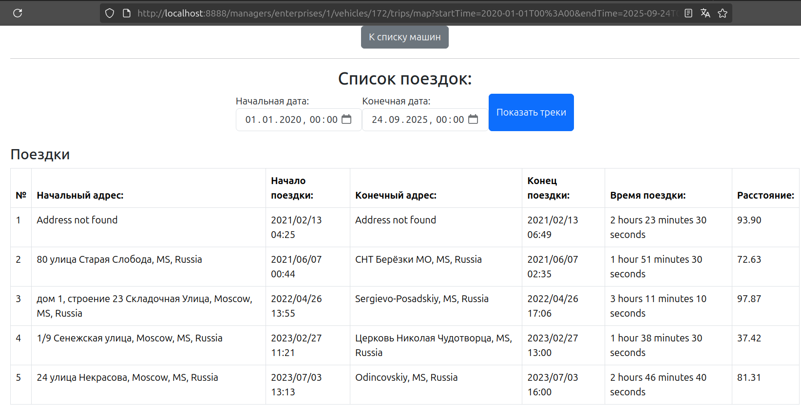
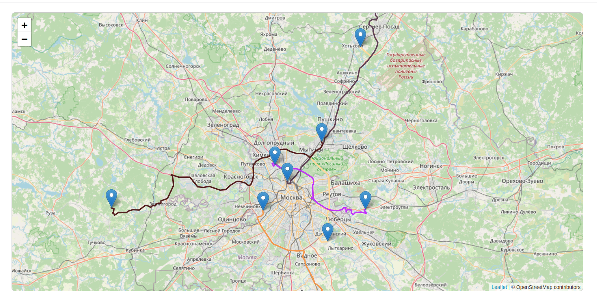

📊 _**Выгрузка отчета о пробеге автомобиля за определенный период**_
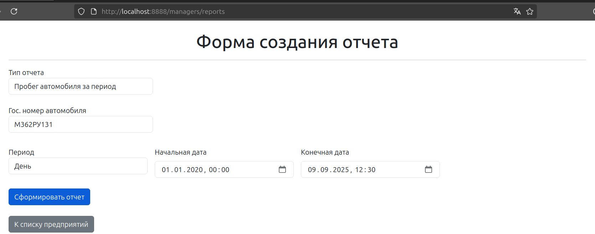
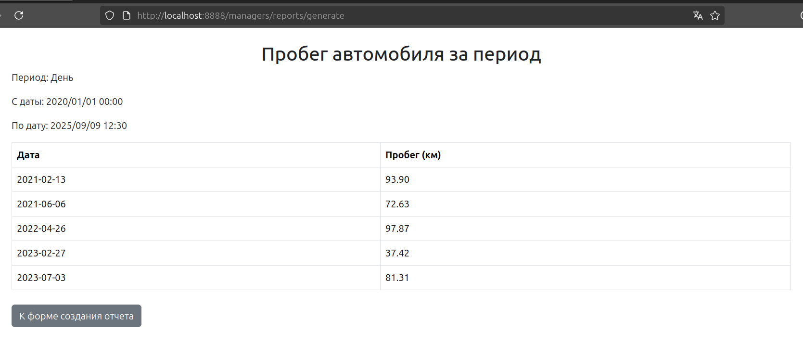

📝 **_Получение запросов по REST c JWT_**
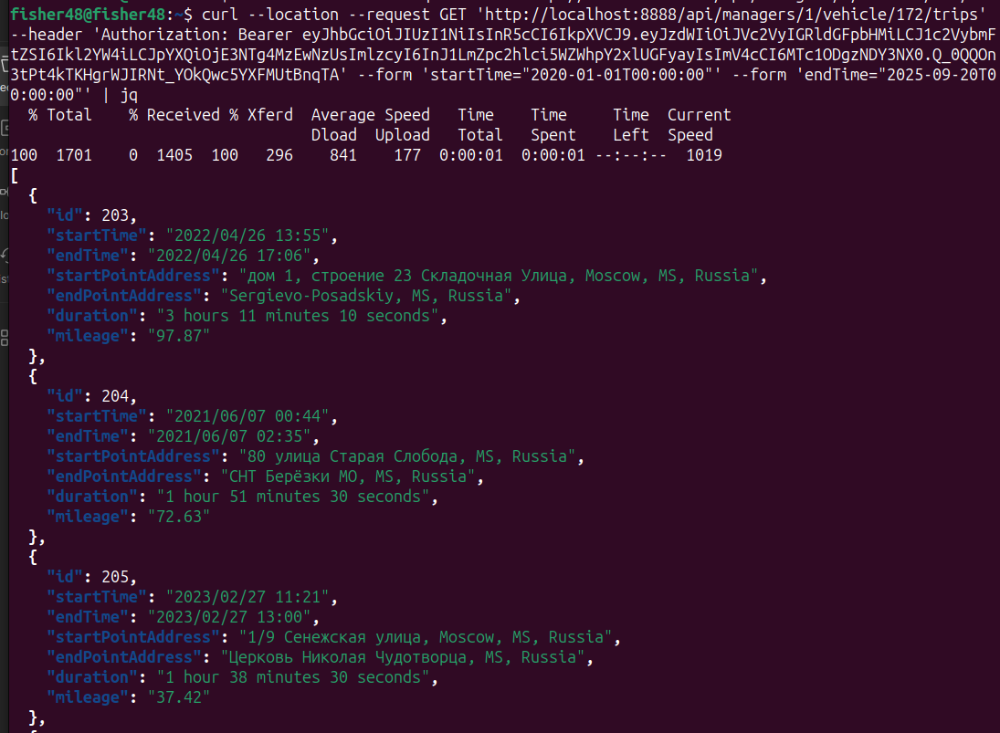

🤖 _**Работа с телеграм-ботом**_  

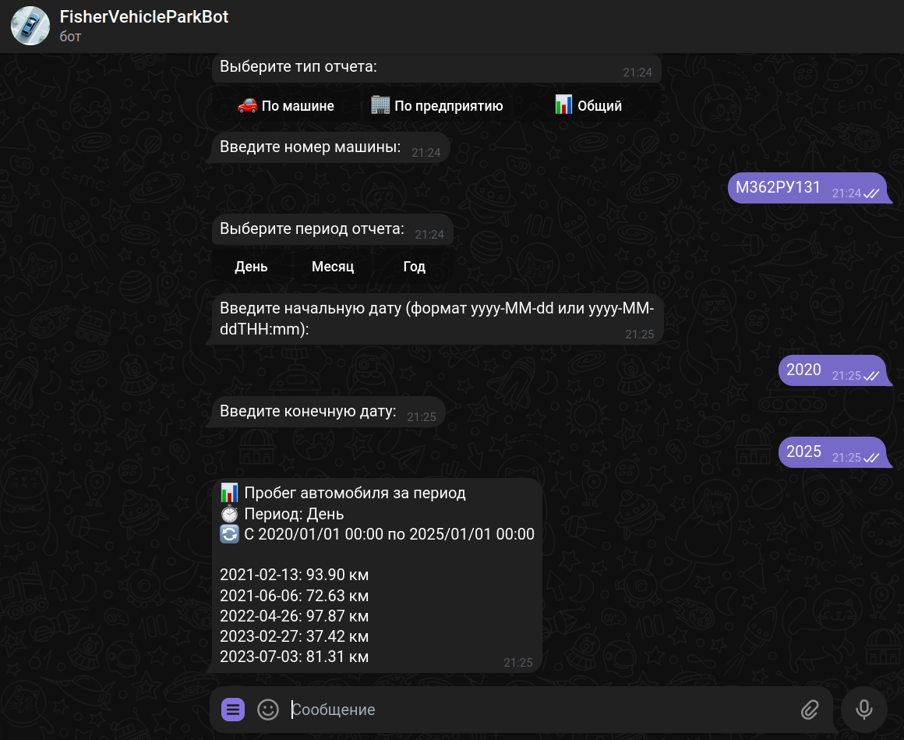  

ℹ️ _**REST API (Swagger UI)**_  
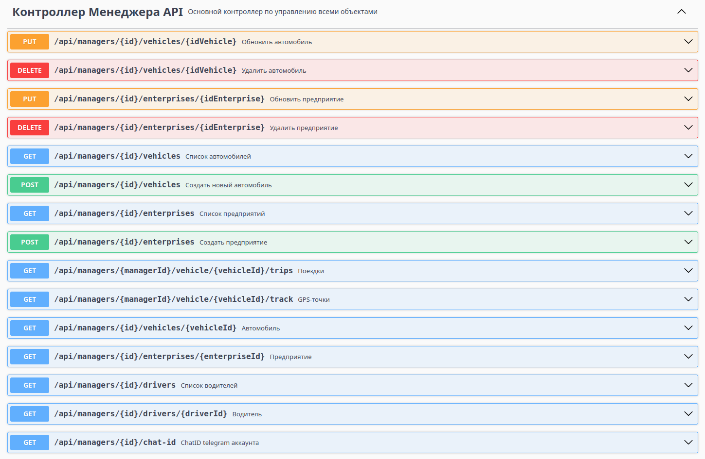
___

🚀 **_Запуск проекта_**
1. Клонирование репозитория  
   `git clone https://github.com/Fisher48/VehiclePark.git`  
   `cd vehiclepark`

2. Запуск проекта (2 варианта)
   1. Через Docker Compose: `docker compose up -d --build`   
   2. Через файл `deploy_local.sh`  
   Даем права на исполнение файлу: `chmod +x deploy_local.sh`  
   Запускаем скрипт: .`/deploy_local.sh` или `bash deploy_local.sh`

3. Доступ к сервисам:

📊 Grafana: http://localhost:3000
(логин/пароль: admin/admin)  
🔍 Prometheus: http://localhost:9090  
🚨 Alertmanager: http://localhost:9093  
⚙️ Swagger UI: http://localhost/api/swagger-ui.html
🤖 Telegram-бот: доступен по токену (подключите в Alertmanager)  

📦 Docker Hub  
Можно загрузить готовый образ:

docker pull fisher48/vehiclepark:latest